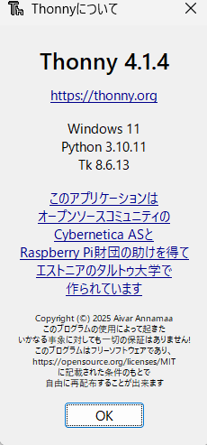
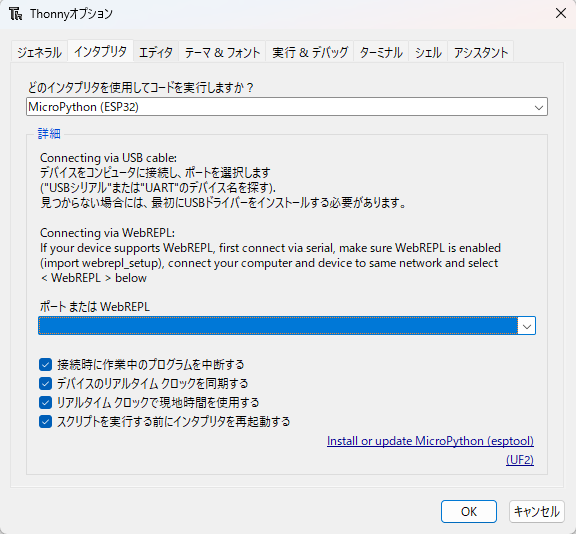
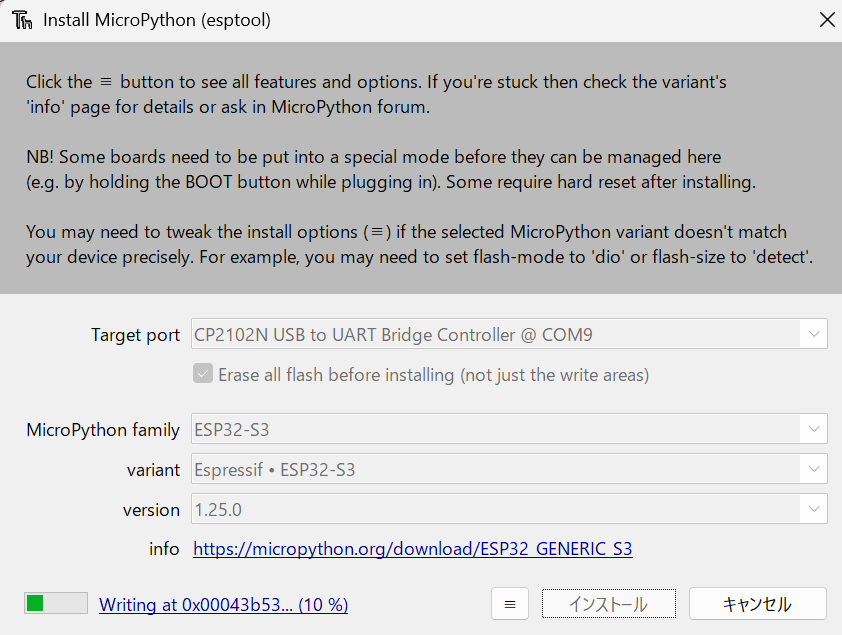
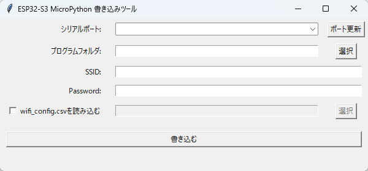
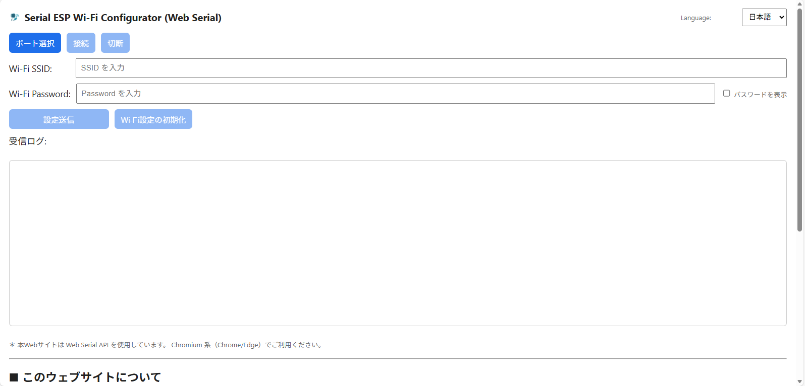

# ESP32用_microPython

更新日 : 2025/10/17

## 1. ファームウエア焼き込み(Thonny)

Thonnyを使用します
[https://thonny.org/](https://thonny.org/)

### 1-1. ファームウエア焼き込みツールの用意

1. インストールしてください(4.1.7のみ動作確認済)
    
    ※Thonny version 4.1.4だと実行時にネットワーク系のエラーが出て動作しません
    
    ### バージョンの見方
    
    1. ヘルプを押す
    2. Thonnyについてを押す
    3. バージョンが確認できる
        
        
        

### 1-2. ESP32へのファームウエア焼き込み

1. Thonnyの画面左上にある、ツールを押して、オプションを押す
2. インタプリタを押す
3. パソコンのUSB端子とESP32-S3 Dev-kit のUART側端子をUSB Type-A to USB microUSBケーブル又はミニチュア家電の場合はUSB Type-A to USB Type-Cケーブルで接続する
4. 「どのインタプリタを使用してコードを実行しますか？」の選択を「MicroPython (ESP32)」にする

1. ポップアップ右下の「Install or update MicroPython(esptool) 」を押す
2. Target portを選択する（見つからない場合はCP2102Nのドライバをダウンロードして、ドライバーを当てておく）
3. MicroPython familyを「ESP32-S3」にする
4. variantを「Espressif・ESP32-S3」にする
5. Verionを「1.25.0」にする
6. インストールを押す

7. 必用な台数全てに焼き込む
8. Thonnyのアプリを終了する

## 2. プログラムの焼き込み

1. パソコンのUSB端子とESP32-S3 Dev-kit のUART側端子をUSB Type-A to USB microUSBケーブル又はミニチュア家電の場合はUSB Type-A to USB Type-Cケーブルで接続する
2. ESP32-S3 Dev-kit とUSBで通信しているアプリケーションを終了する（ArudinoやThonnyなど）
3. プログラムをダウンロードする
4. 「model-1」フォルダを開く
5. 「model-1_FirmV2_python」フォルダを開く
6. 「Python_焼き込み.py」をお好みのエディタで開く
7. 実行してみる(画面が立ち上がったら6をスキップ)
8. pyserialのインポートエラーになったらターミナルで「python -m pip install pyserial」を実行してpyserialインストールする
9. 「ポート更新」を押す
    
    
10. シリアポートを選択する
11. 「選択」を押す
12. プログラムフォルダを選ぶ(「ECHONET_Lite_AirConditioner」又は「ECHONET_Lite_ElectricLock」又は「ECHONET_Lite_GeneralLight」)
13. 「SSID:」の欄にWi-FiのSSIDを入力する
14. 「PASS:」の欄にWi-FiのPasswordを入力する
15. 「書き込む」を押す
16. 完了画面が出力されたら完了

### オプション機能：CSVファイルのデータでWi-Fiの接続設定をする方法

最初にwifi_config.csvを何らかのソフトウエアで開いて「StandardSSID」と「StandardPASS」を接続するWi-Fiの「SSID」と「PASS」に変更しておく

1. 「wifi_config.csvを読み込む」左のチェックボックスにチェックを入れる
2. 「書き込む」を押す
3. 完了画面が出力されたら完了

## 3. Wi-Fi接続設定のみを簡単に変更する方法

1. パソコンのUSB端子とESP32-S3 Dev-kit のUART側端子をUSB Type-A to USB microUSBケーブル又はミニチュア家電の場合はUSB Type-A to USB Type-Cケーブルで接続する
2. ESP32-S3 Dev-kit とUSBで通信しているアプリケーションを終了する（ArudinoやThonnyやPythoのプログラムなど）
3. [Serial ESP Wi-Fi Configurator (Web Serial)](https://www.sugi-lab.net/utility/Serial_ESP_Wi-Fi_Configrator.html)にアクセスする
    
    
    
4. 「ポート選択」を押す
5. ポートを選ぶ
6. 「SSIDを入力」にWi-FiのSSIDを入力する
7. 「Passwordを入力」にWi-FiのPASSを入力する
8. 「設定送信」を押す
9. IPアドレスが表示されたら設定完了

## 4. ライセンス

### 使用ライブラリとライセンス / Libraries and Licenses

このプログラムは、以下のオープンソースライブラリを使用しています。

This program uses the following open-source libraries:

---

### Python 標準ライブラリ（tkinter, csv, os, subprocess など）

- **License**: Python Software Foundation License (PSFL)
- **Copyright**: © Python Software Foundation
- **URL**: [https://docs.python.org/3/license.html](https://docs.python.org/3/license.html)

---

### Tcl/Tk（tkinter の内部で使用）

- **License**: BSD-style Tcl/Tk License
- **Copyright**: © Scriptics Corporation / ActiveState
- **URL**: [https://www.tcl.tk/software/tcltk/license.html](https://www.tcl.tk/software/tcltk/license.html)

---

### PySerial（serial.tools.list_ports）

- **License**: BSD License
- **Copyright**: © Chris Liechti
- **URL**: [https://github.com/pyserial/pyserial/blob/master/LICENSE.txt](https://github.com/pyserial/pyserial/blob/master/LICENSE.txt)

---

これらのライブラリは、いずれも商用利用や再配布が認められている寛容なライセンスの下で提供されています。

These libraries are provided under permissive licenses that allow commercial use and redistribution.